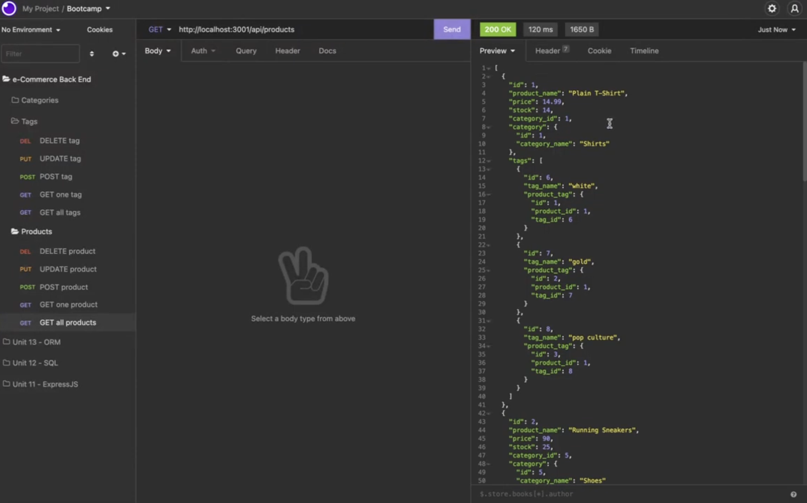

# e-Commerce Back End

## Description
    
This project consists of building the back end for an e-commerce website.
    
## Usage
    
The following video demonstrates the process of making API requests.

## Contribute
    
If you would like to contribute to this project, feel free to make a pull request.
    
## Questions

If you have any questions, open an issue or contact me directly at abimael.monarrez58@gmail.com. You can find more of my work at [Abimael1996](https://github.com/Abimael1996).

